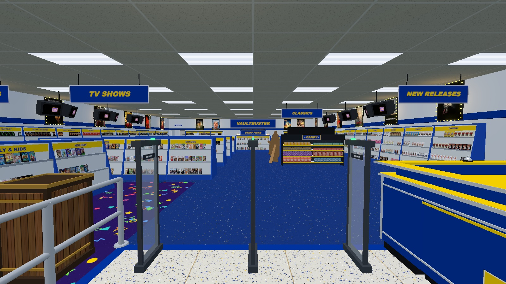
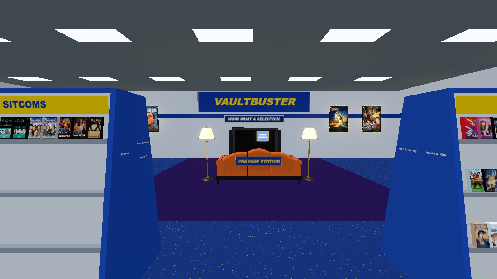
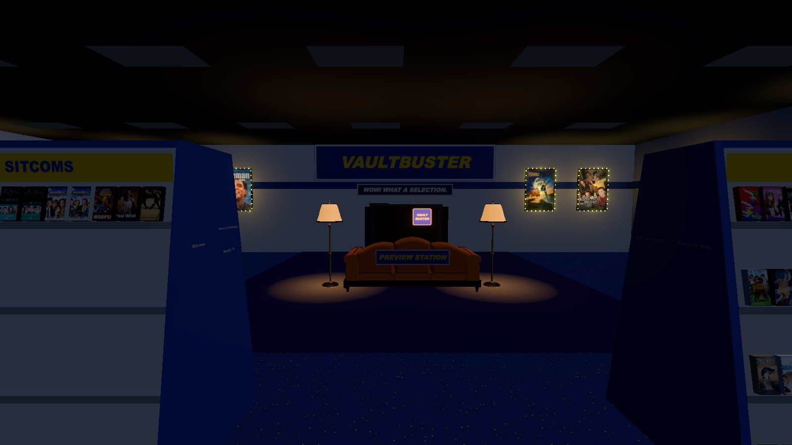
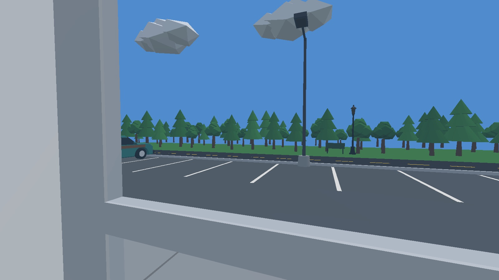
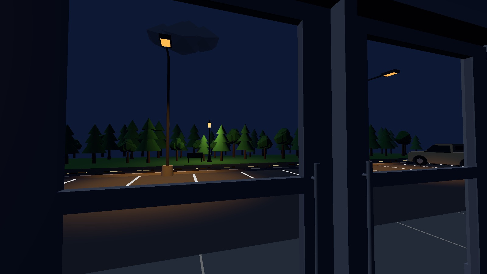
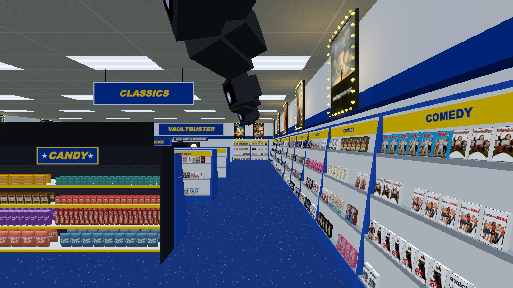

# VaultBuster

**A first-person 90s video store you can actually rent from.**



Walk the aisles of a fluorescent-lit rental store, pull a tape off the shelf, and play it on the big-screen TV in the lounge. Every one of the 1,600+ tapes streams real episodes and movies from the Internet Archive. It's built in three.js with no build step and no dependencies, and it runs straight from a `file://` URL.

---

## Screenshots

| Lights on | Lights out |
|---|---|
|  |  |
|  |  |



---

## Features

**The store**
- 1,607 titles, one tape per movie or per TV season, grouped by genre.
- **New Releases walls:** every movie from 1991 on lines the outer walls, face-out. The sections run from the register wall, around the back, and down the far wall, in order Comedy, Drama, Action & Adventure, Horror, Sci-Fi & Fantasy. Hits get extra copies, up to 12, based on TMDB vote counts, so the walls fill up with about 1,230 tapes.
- **Kids section:** in the front corner by the windows, on low shelves over its own confetti carpet. It holds kids' movies, Kids & Educational, Holiday, and the kids' shows from Animation and Anime.
- **Center:** low gondolas on either side of the walkway to the lounge. Pre-1991 classic movies are by genre on the register side, with a second copy of the most-voted ones. TV is on the other side.
- **Staff Picks:** a low display at the end of the walkway, facing the entrance. It holds one copy each of hand-picked movies (Hackers, Gremlins 2, Blade Runner, Mac and Me, …) and TV (The Twilight Zone, Twin Peaks, The Whitest Kids U'Know, Quantum Leap, Dragon Ball Z).
- Real TMDB poster art on every cover. TV tapes get their own season's poster when TMDB has one.
- A checkout and returns counter, a drink cooler and popcorn cart, a candy aisle facing the register that you can grab from, and movie posters in blinking marquee frames.

**The TV lounge**
- Put a tape in the big projection TV and every screen in the store plays it, including the ceiling CRTs over the aisles.
- When nothing is playing, the screens run a bouncing **VAULTBUSTER** logo screensaver, DVD-logo style.
- The lounge sits on the Overlook Hotel's hexagon carpet from *The Shining*.
- A couch for sitting and watching, with mouse-wheel zoom to lean in toward the screen.

**Lighting**
- Tap **L** for lights out. The overhead fluorescents flicker back on when you turn them back on, and a few of them stutter before they settle.
- In the dark, the TV lights up the room in whatever colors are on screen, and the ceiling CRTs light the shelves under them.
- The screens, marquee bulbs, and lamps glow. Signs never do.

**Back of house**
- A wide opening in the back wall, on the TV Shows side under a **RESTROOMS** sign, leads to a back hallway with a break room and a restroom off it.
- A locked door at the far end of the hall is there for whatever gets built next.

**Outside**
- The storefront is glass. Outside there's a sidewalk, a striped parking lot with three parked cars, a road, a bench under an iron park lamp, and a treeline.
- The time of day follows the store lights. Lights on means blue sky, sun, and drifting clouds. Lights out means a moonlit midnight-blue night, with sodium street lights glowing orange over the lot.

**Saved between visits**
- The store remembers itself in your browser's local storage: where you're standing, the lights and lamps, doors, your inventory (with bites left and popcorn fill), the returns bin, which copies are out on rental, the tape in the VCR, and the last episode you watched of each title.
- A tape that was playing starts its episode again on your first click into the store. archive.org streams can't seek, so it's the episode that resumes, not the exact minute.
- To start fresh, type `SYSRESET` at the register terminal.

---

## Running it

You need an internet connection. three.js loads from a CDN, and the tapes stream from archive.org.

**Easiest:** open `index.html` in a browser. It works from `file://` with no server needed.

**Or serve it locally:**

```sh
node server.js          # http://localhost:5000
node server.mjs [port]  # http://localhost:8123 by default
```

Neither server has any dependencies.

---

## Controls

| Key | Action |
|---|---|
| **W A S D** | Walk |
| **Mouse** | Look |
| **Shift** | Hustle |
| **C** | Crouch |
| **Click** a tape | Pick it up and hold it up to look at it |
| **Click** again | Tuck it in your hand |
| **Right-click** | Put back a tape you're still looking at (straight off the shelf or out of Returns) · put down an untouched snack |
| **Click** a snack, drink or popcorn in hand | Take a bite or a sip |
| **Right-click** the TV screen | Picture settings menu |
| **E** | Put the tape in the TV · sit or stand at the couch · switch a lamp on or off · drop a tape in Returns (click the bin to look at / take one, like a shelf) · open or close a door · log in to the register terminal (Esc / F10 logs off) |
| **Space** | Pause / play |
| **, .** | Previous / next episode |
| **L** (tap) | Store lights on/off, which also switches day and night |
| **L** (hold) | Both side lamps on/off |
| **Mouse wheel** | Zoom while seated · otherwise switch the item in hand when carrying several |
| **1–9** | Pick an inventory slot (carry up to 9 items; the bar appears once you hold 2+) |
| **H** | Hide the HUD |
| **F** | Fullscreen |

---

## How it's put together

Everything runs as plain `<script>` files loaded in order. There are no ES modules, so the page works from `file://`. The one exception is a small inline module in `index.html` that imports three.js and its post-processing add-ons from the CDN, puts them on `window`, and then loads `store.js`.

| File | What it is |
|---|---|
| `index.html` | The page, the HUD, and the three.js bootstrap |
| `store.js` | The whole game: the building, shelving and packing, the lounge, lighting, the exterior, and playback |
| `couch.js` | The procedurally built parlor sofa |
| `catalog.js` | Generated tape catalog (`window.VAULT_CATALOG`) |
| `covers.js` | Generated TMDB cover art, embedded as data URIs (`window.VAULT_ART`) |
| `meta.js` | Generated release year and TMDB vote count per title (`window.VAULT_META`), used to sort the New Releases walls |
| `art.js` | The older embedded cover art. `fetch-covers.mjs` falls back to it for the few shows TMDB can't match |
| `server.js`, `server.mjs` | Optional static servers, no dependencies |
| `drive.mjs` | Headless Playwright smoke test that walks in, picks a tape, and plays it |

### Rebuilding the data

The catalog and covers are generated from a local VaultVision library, which the scripts expect at `../VaultVision` unless you pass a different path.

```sh
node build.mjs [path-to-VaultVision]                         # -> catalog.js
TMDB_API_KEY=... node fetch-covers.mjs [path-to-VaultVision] # -> covers.js, meta.js
```

`fetch-covers.mjs` has an `OVERRIDES` table for fixing wrong TMDB matches. The raw source images in `art/` are gitignored. The game doesn't need them at runtime.
