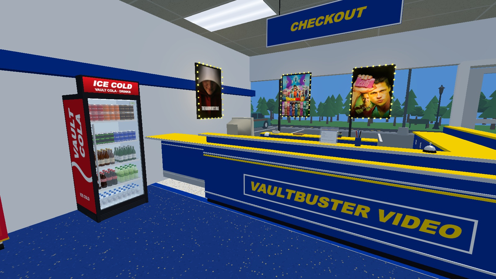
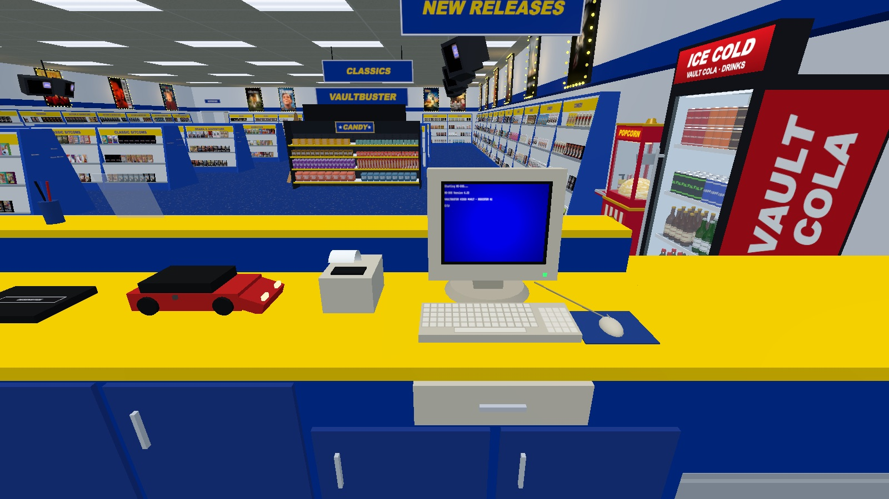
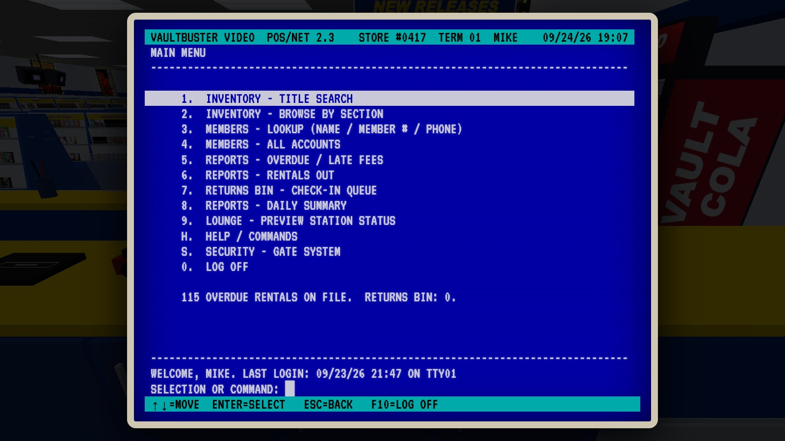
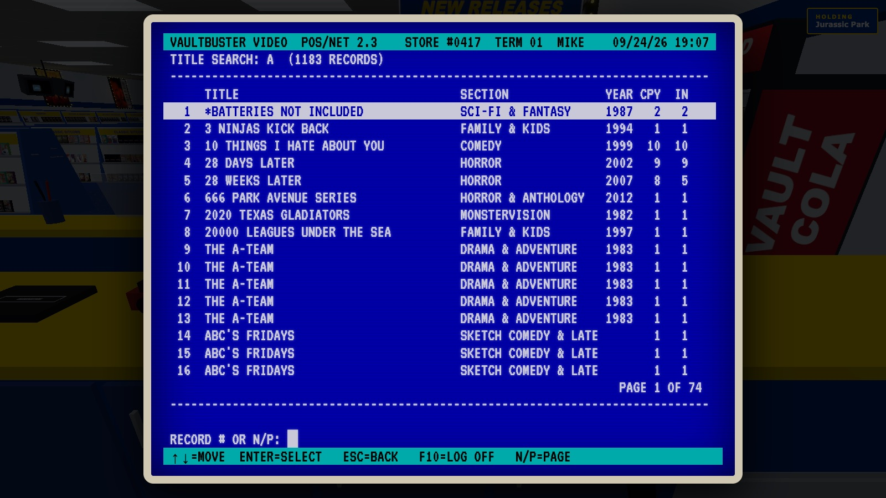
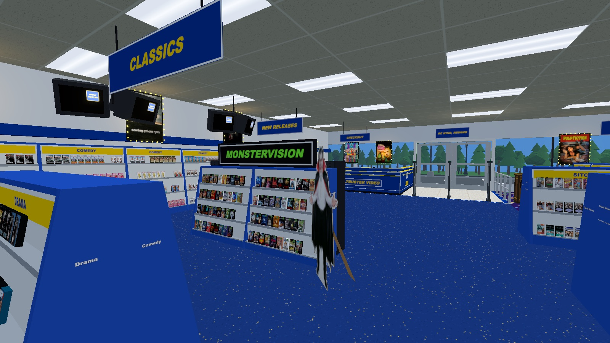

# VaultBuster

**Clock in for a shift at a 90s video store.**

**▶ [Play it in your browser](https://chairpants.github.io/VaultBuster/)**


It's a Friday night and the store is yours. Work the counter, run the register, keep the shelves straight, and deal with whatever the night throws at you. It's a first-person sim of life behind the counter at a neighborhood rental store, down to the rewinder and the security gates.

---

## Screenshots

| | |
|---|---|
|  |  |
|  |  |
|  |  |

| Lights on | Lights out |
|---|---|
|  |  |
|  |  |

---

## Features

- **A real store to run:** 1,600+ tapes on the shelves, a counter, a back room, and a parking lot out front.
- **A working register:** a 90s DOS-style point-of-sale system with inventory, members, and reports. Log in and poke around.
- **Counter gear that works:** rewind tapes, desensitize them at checkout, ring the bell, and work the returns slot.
- **Security gates** that do exactly what you'd expect when a tagged tape walks out the door.
- **Almost everything is interactive.** Pick things up, carry them around, restock, eat the snacks. Most of it is yours to find.
- **MonsterVision:** Joe Bob Briggs' late-night movies get a section of their own, with a guest who's happy to be moved around.
- **Lights out:** close up for the night, and it's dark outside too.
- **The store remembers.** Clock out, come back, and everything is where you left it.

---

## Running it

You need an internet connection, because three.js loads from a CDN.

**Easiest:** play the hosted version at **https://chairpants.github.io/VaultBuster/**.

**Locally:** open `index.html` in a browser. It works from `file://` with no server needed.

**Or serve it locally:**

```sh
node server.js          # http://localhost:5000
node server.mjs [port]  # http://localhost:8123 by default
```

Neither server has any dependencies.

---

## Controls

| Key | Action |
|---|---|
| **W A S D** | Walk |
| **Mouse** | Look |
| **Shift** | Hustle |
| **C** | Crouch |
| **Click** a tape | Pick it up and hold it up to look at it |
| **Click** again | Tuck it in your hand |
| **Right-click** | Put back a tape you're still looking at (straight off the shelf or out of Returns) · put down an untouched snack |
| **Click** a snack, drink or popcorn in hand | Take a bite or a sip |
| **E** | Interact: doors, lamps, the register, the counter gear, and plenty more. Some things want E held down |
| **L** (tap) | Store lights on/off, which also switches day and night |
| **L** (hold) | Both side lamps on/off |
| **Mouse wheel** | Zoom while seated · otherwise switch the item in hand when carrying several |
| **1–9** | Pick an inventory slot (carry up to 9 items; the bar appears once you hold 2+) |
| **H** | Hide the HUD |
| **F** | Fullscreen |

---

## How it's put together

Everything runs as plain `<script>` files loaded in order. There are no ES modules, so the page works from `file://`. The one exception is a small inline module in `index.html` that imports three.js and its post-processing add-ons from the CDN, puts them on `window`, and then loads `store.js`.

| File | What it is |
|---|---|
| `index.html` | The page, the HUD, and the three.js bootstrap |
| `store.js` | The whole game: the building, shelving and packing, the lounge, lighting, the exterior, and the TVs |
| `couch.js` | The procedurally built parlor sofa |
| `pos.js` | The register's DOS-style POS terminal |
| `monstervision.js` | Splits the single MonsterVision broadcast tape into one tape per film, with each airing mapped to its real title and year |
| `mv-covers.js` | Generated TMDB posters for the MonsterVision films (kept out of `covers.js`, which is near GitHub's 50 MB warning) |
| `catalog.js` | Generated tape catalog (`window.VAULT_CATALOG`) |
| `covers.js` | Generated TMDB cover art, embedded as data URIs (`window.VAULT_ART`) |
| `meta.js` | Generated release year and TMDB vote count per title (`window.VAULT_META`), used to sort the New Releases walls |
| `art.js` | The older embedded cover art. `fetch-covers.mjs` falls back to it for the few shows TMDB can't match |
| `server.js`, `server.mjs` | Optional static servers, no dependencies |
| `drive.mjs` | Headless Playwright smoke test that walks in, picks a tape, and plays it |

### Rebuilding the data

The catalog and covers are generated from a local VaultVision library, which the scripts expect at `../VaultVision` unless you pass a different path.

```sh
node build.mjs [path-to-VaultVision]                         # -> catalog.js
TMDB_API_KEY=... node fetch-covers.mjs [path-to-VaultVision] # -> covers.js, meta.js
TMDB_API_KEY=... node fetch-mv-covers.mjs                    # -> mv-covers.js
```

`fetch-covers.mjs` has an `OVERRIDES` table for fixing wrong TMDB matches. The raw source images in `art/` are gitignored. The game doesn't need them at runtime.
