# VaultBuster

**Clock in for a shift at a 90s video store.**

**▶ [Play it in your browser](https://chairpants.github.io/VaultBuster/)**

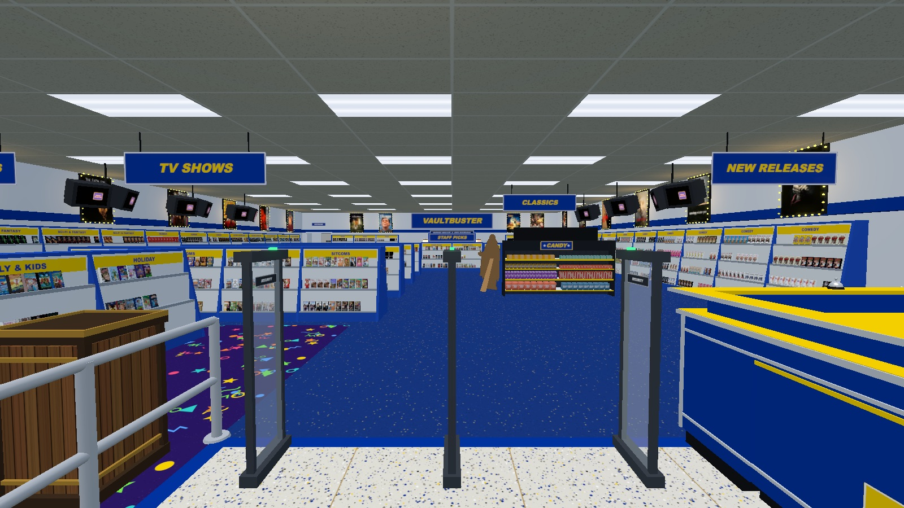

It's a Friday night and the store is yours. Work the counter, run the register, keep the shelves straight, and deal with whatever the night throws at you. It's a first-person sim of life behind the counter at a neighborhood rental store, down to the rewinder and the security gates.

---

## Screenshots

| | |
|---|---|
| 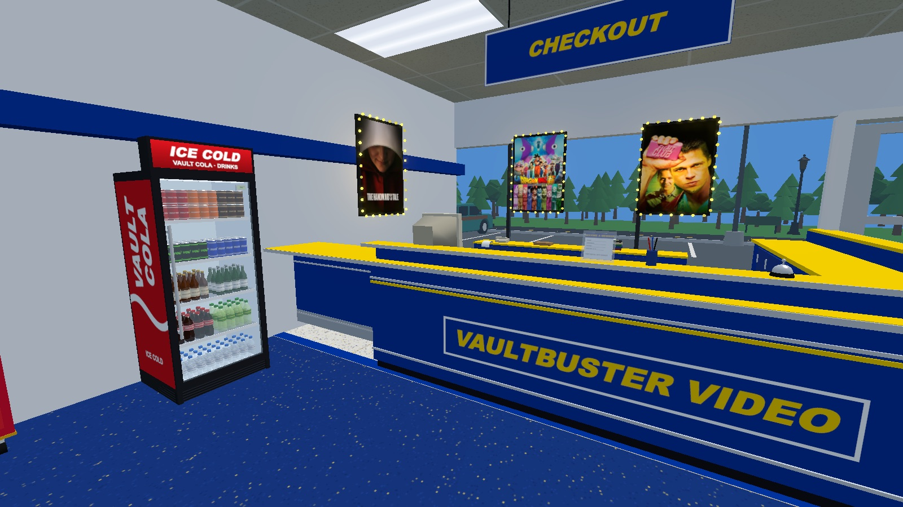 | 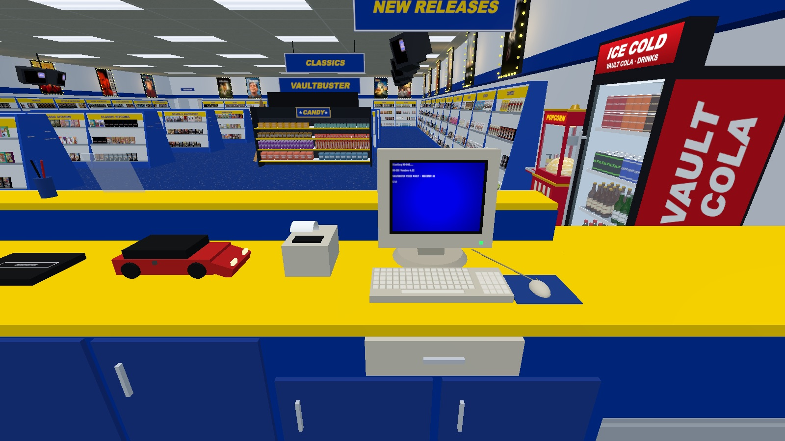 |
| 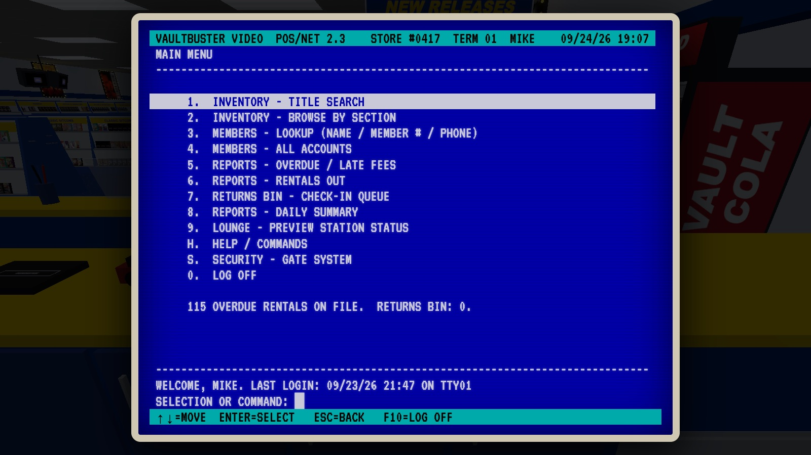 | 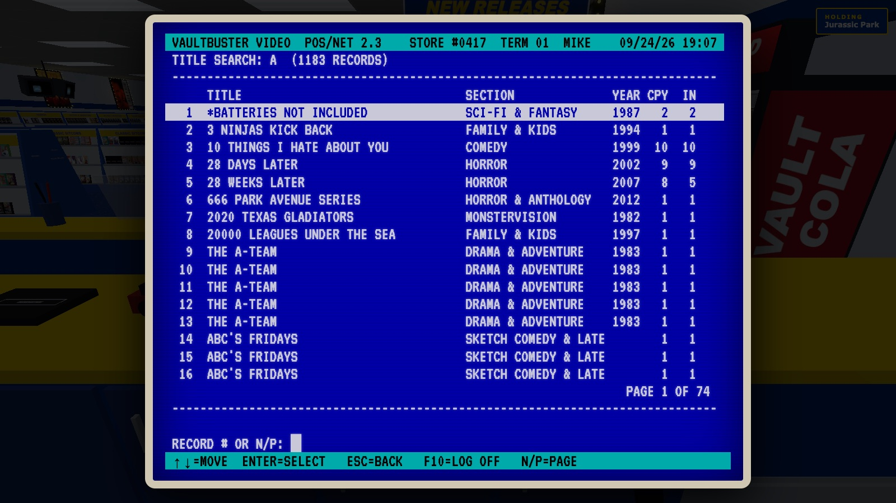 |
| 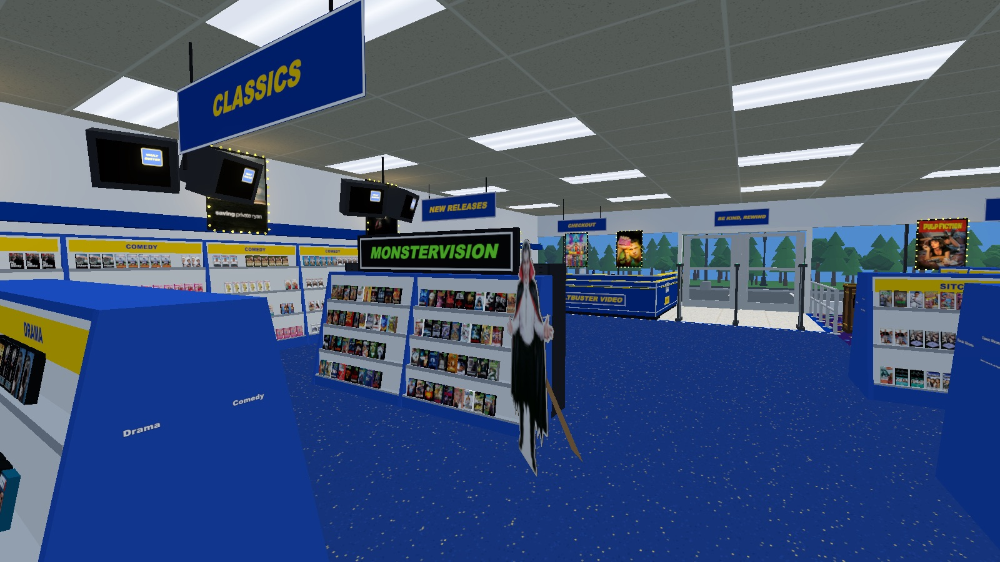 | 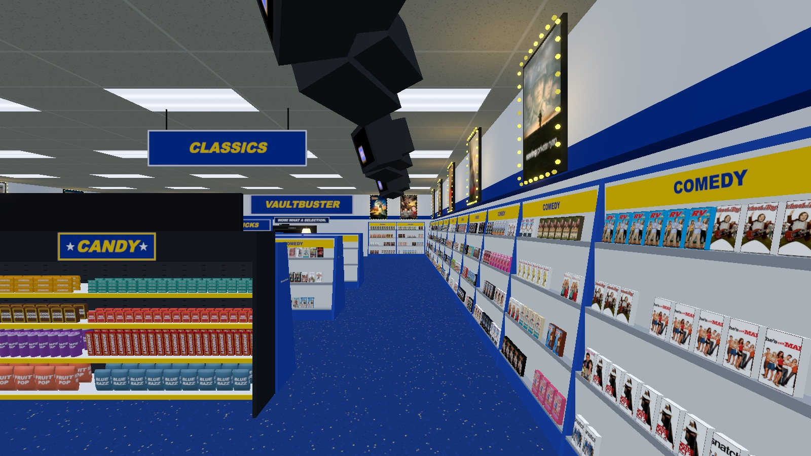 |

| Lights on | Lights out |
|---|---|
| 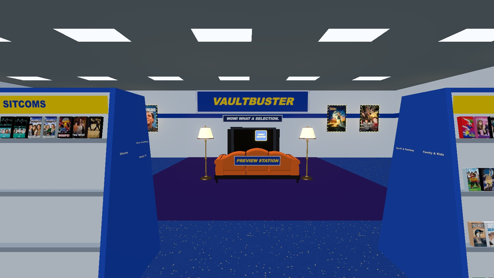 | 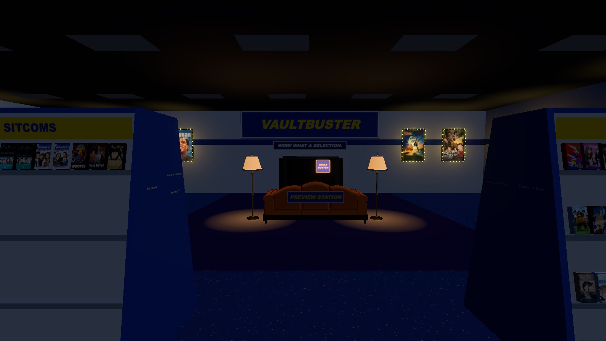 |
| 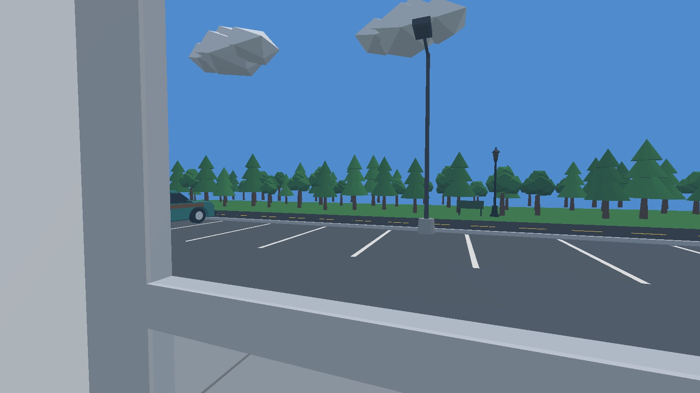 | 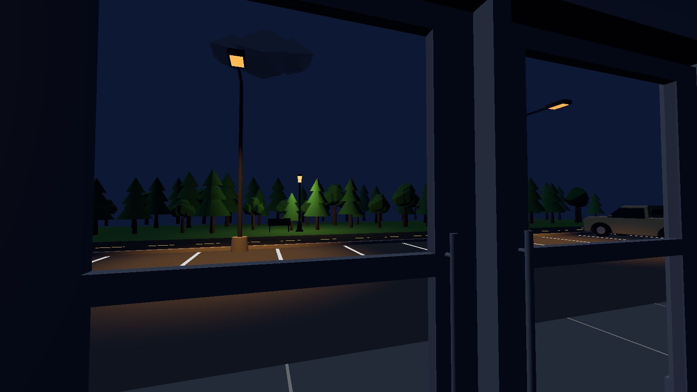 |

---

## Features

- **A real store to run:** 1,600+ tapes on the shelves, a counter, a back room, and a parking lot out front.
- **A working register:** a 90s DOS-style point-of-sale system with inventory, members, reports, ordering and staff scheduling. A pixel-art VAULTBUSTER header, color-coded fields, and a main menu boxed into sections. Its login screen stays up on the monitor (with the returns bin, overdue count and tonight's feature at a glance); log in with Enter or a click. Works with the keyboard (F1 help, F2 find, ESC back, F10 log off) or the mouse.
- **Counter gear that works:** rewind tapes, desensitize them at checkout, ring the bell, and work the returns slot.
- **Security gates** that do exactly what you'd expect when a tagged tape walks out the door.
- **Almost everything is interactive.** Pick things up, carry them around, restock, eat the snacks. Most of it is yours to find.
- **MonsterVision:** Joe Bob Briggs' late-night movies get a section of their own, with a guest who's happy to be moved around.
- **Real light switches:** the store is wired in zones, and the back rooms have their own. Daylight comes in through the front windows.
- **Two ways to play:** *Simulation* starts you in a bare-bones store (no staff, the theater chained shut, no popcorn machine, part of the library off the shelves) and you build it up out of what it earns: hire staff, open the theater, and buy Library Upgrades 1–3. It starts with a small member base: new people come in to sign up at the counter (take their form, enter them on the register, hand them a card), drawn by word of mouth from good shifts, newspaper ads and what you've built. *Sandbox* has everything open, Dana on staff and $5,000 in the budget. The main menu has three save slots (continue one, load another, or start a new store in any of them) and settings for store-sound and TV volume, mouse sensitivity, invert Y and shift length.
- **Work the counter well:** checkouts score points for speed and getting every step right. Late fees owed get charged or waived at the register, a snack can be upsold, and the receipt printer prints a slip you tear off and hand over. Watch for shoplifters: a customer with darting eyes heading for the door has something under their jacket. A friendly hello (or an obvious eye on them) can change their mind. Stop one before the gates and decide what happens: a ban, a cancelled membership, the police, or a warning, all of which go on their account. One who gets away is only named if you'd seen who they were.
- **Skills that level up:** six RPG stats, translated to the job. **DEX** (register work, rewinding, desensitizing), **INT** (shelving, finding the exact title someone asked for, holds), **CHA** (upsells, recommendations, fees, the phone, sign-ups), **STR** (restocking, unpacking deliveries), **CON** (cleaning up, miles walked) and **WIS** (spotting shoplifters). Doing the work earns XP in its stat, and each level takes longer than the last (max 20). Levels pay off: quicker hands at the register and rewinders, more boxes carried, a faster walk, better odds on a pitch; at INT 3 a request tells you whether it's on the shelf, and at WIS 3 you get a heads-up about someone sneaking out. **K** opens the character sheet for you and every employee.
- **Hiring:** buy *Hire an Employee* on the register and three applicants come in, each with their own name, look (build, height, head) and stats. Every applicant's stats add up to the same total, so each is good at something different. Pick one (or pass and get a refund). You can hire up to four; each hire costs more than the last, and wages rise with an employee's level. Staff level up the same way you do, so a clumsy new hire becomes a fast one. *Staff Training* makes them learn 50% faster. Sandbox starts you with Dana.
- **The schedule:** each employee is part time, up to 25 hours a week, set hour by hour on the register's STAFF SCHEDULE screen: the whole week on one grid, days across, hours down, a colored lane per employee (arrows and space, or click and drag). They come in the front door when their shift starts and leave the same way when it ends. Whoever's still in at midnight stays until you send them home (E on them after close). Wages are paid by the scheduled hour.
- **The job board:** a cork board behind the counter is a grid, RimWorld style: jobs across the top (register, phones, floor help, returns, restock, cleanup), employees down the side. Each cell is a 1 (first) to 4, or X for never. Each employee works their highest-priority job that has work, and customer-facing jobs pull them off background work when they outrank it. Arrow keys move around the grid; 1–4, X or Space set a cell.
- **The phone:** every couple of hours a member calls to ask if you have something in. Say you'll hold it and a copy had better be on the holds shelf when they come in for it. Customers in the store come first: a call missed while you're busy costs nothing, but picking up with someone waiting at the counter does. Staff take calls when the store's quiet.
- **Customers who want something:** some come to the counter asking for a title, others for "something scary". Find it, bring it, hand it over (E with the tape in hand), or tell them it's all out (Q). Leave them waiting and an employee goes to find it. How members are treated builds their loyalty: regulars visit more and wait longer, and the unhappy ones stop coming. The day has a rhythm too: slow mornings, the after-school wave, a big Friday night.
- **Keep the place in shape:** snacks and drinks don't refill themselves. The stock cupboards behind the counter hand you what the racks are missing, and you put it out. Order more on the register; it arrives next morning as boxes by the front door. Customers shove tapes back in the wrong place and drop litter; straighten up, or let the staff do it. The trash fills up too: the lobby bin with the customers (the busier the store, the faster), the break room can and the restroom wastebasket more slowly. A full bin spills onto the floor. E on a bin ties off the bag; carry up to two to the trash chute in the janitor's closet (right-click sets them down). Staff take the trash out under CLEANUP. Whatever's left undone at close costs you on the closing check.
- **Run the business:** a star rating that rises and falls with each night's shift and brings in more (or fewer) customers. Pick tonight's feature on the register; customers buy tickets at checkout and show up at 7:45, and the film had better be in the VCR by 8. Spend the budget on upgrades: security cameras, anti-theft signs, a second rewinder and then high-speed ones (shaped like little sports cars), a better cooler compressor, staff training, or an ad in the paper.
- **A shift on the clock:** you're in at 9 AM with the doors still locked (an hour to get things ready), the store's open 10 AM to midnight, about 21 minutes of play, and the sky outside slides from morning through golden hour and sunset into night. At midnight the clock slows to real time, and the day ends only when you lock up and walk out the front doors. Each shift ends with a printed slip and a grade.
- **The store remembers.** Clock out, come back, and everything is where you left it.

---

## Running it

You need an internet connection, because three.js loads from a CDN.

**Easiest:** play the hosted version at **https://chairpants.github.io/VaultBuster/**.

**Locally:** open `index.html` in a browser. It works from `file://` with no server needed.

---

## Controls

| Key | Action |
|---|---|
| **W A S D** | Walk |
| **Mouse** | Look |
| **Shift** | Hustle |
| **C** | Crouch |
| **Click** a tape | Pick it up and hold it up to look at it |
| **Click** again | Tuck it in your hand |
| **Right-click** | Put back a tape you're still looking at (straight off the shelf or out of Returns) · put down an untouched snack |
| **Click** a snack, drink or popcorn in hand | Take a bite or a sip |
| **E** | Interact: doors, lamps, the register, the counter gear, and plenty more. Some things want E held down. On the stool behind the counter, each tap spins you (tap fast to spin harder) and WASD gets you up; hold E on it to carry it somewhere else. Hold E on a rewinder, the desensitizer or the receipt printer to move it around the counter: a see-through copy shows where it'll go (only over free worktop), the wheel turns it, click sets it down, right-click puts it back |
| **Q** | At the counter: offer the customer a snack (they'll go grab it and come back), or waive their late fees |
| **L** | Skip ahead an hour (until close). The store lights are real switches on the walls: E flips one, and holding E on the panel by the register turns the whole panel on or off |
| **Mouse wheel** | Zoom while seated · otherwise switch the item in hand when carrying several |
| **1–9** | Pick an inventory slot (carry up to 9 items; the bar appears once you hold 2+) |
| **K** | Character sheet: your skills and the staff's, with XP toward the next level |
| **H** | Hide the HUD |
| **M** | Store sounds on/off (fluorescent hum, air, traffic outside, the door chime, footsteps, doors, the cooler) |
| **J** | Show or hide the log (bottom left) · **PgUp / PgDn** scroll it |
| **1–5** | When you've caught a shoplifter: ban a week / a month, cancel their membership, call the police, or let them off with a warning |
| **F** | Fullscreen |

---

## How it's put together

Everything runs as plain `<script>` files loaded in order. There are no ES modules, so the page works from `file://`. The one exception is a small inline module in `index.html` that imports three.js and its post-processing add-ons from the CDN, puts them on `window`, and then loads `store.js`.

| File | What it is |
|---|---|
| `index.html` | The page, the HUD, and the three.js bootstrap |
| `store.js` | The whole game: the building, shelving and packing, the lounge, lighting, the exterior, and the TVs |
| `couch.js` | The procedurally built parlor sofa |
| `pos.js` | The register's DOS-style POS terminal |
| `ambience.js` | The store's ambient sound, modelled from the physics of each source rather than recorded: ballast hum, room tone, Doppler-shifted traffic through the glass, the entry chime, footsteps, latches and hinges, swing doors, the cooler's door and compressor |
| `monstervision.js` | Splits the single MonsterVision broadcast tape into one tape per film, with each airing mapped to its real title and year |
| `mv-covers.js` | Generated TMDB posters for the MonsterVision films (kept out of `covers.js`, which is near GitHub's 50 MB warning) |
| `catalog.js` | Generated tape catalog (`window.VAULT_CATALOG`) |
| `covers.js` | Generated TMDB cover art, embedded as data URIs (`window.VAULT_ART`) |
| `meta.js` | Generated release year and TMDB vote count per title (`window.VAULT_META`), used to sort the New Releases walls |
| `art.js` | The older embedded cover art. `fetch-covers.mjs` falls back to it for the few shows TMDB can't match |
| `tests/smoke.mjs` | The smoke tests (see Testing) |
| `tests/shot.mjs` | A screenshot (or frame timing) from anywhere in a fresh store |

### Testing

`tests/smoke.mjs` loads the game headless from `file://` and drives each system through its test hooks: the menu and save slots, a full checkout, restocking, a phone hold, moving counter gear, save/reload, the restroom, and a fresh Simulation store. It needs Node and a Chromium:

```sh
npm install                      # playwright-core (dev only; the game itself has no build)
npx playwright install chromium  # or set PLAYWRIGHT_CHROMIUM_PATH to any Chrome/Chromium
npm test                         # a few minutes: it renders in software
```

To look at something, `tests/shot.mjs` puts you at a spot and takes a screenshot. Add `--setup "<js>"` to arrange things first through the `window.__t` hooks, or `--gpu --fps` to time frames on the real GPU:

```sh
node tests/shot.mjs closet.png 10.3,29.1,-1.7,0.1 --setup "__t.setZone('closet', true)"
node tests/shot.mjs - 3,12,3.14,0 --mode simulation --gpu --fps
```

### Rebuilding the data

The catalog and covers are generated from a local VaultVision library, which the scripts expect at `../VaultVision` unless you pass a different path.

```sh
node build.mjs [path-to-VaultVision]                         # -> catalog.js
TMDB_API_KEY=... node fetch-covers.mjs [path-to-VaultVision] # -> covers.js, meta.js
TMDB_API_KEY=... node fetch-mv-covers.mjs                    # -> mv-covers.js
```

`fetch-covers.mjs` has an `OVERRIDES` table for fixing wrong TMDB matches. The raw source images in `art/` are gitignored. The game doesn't need them at runtime.
