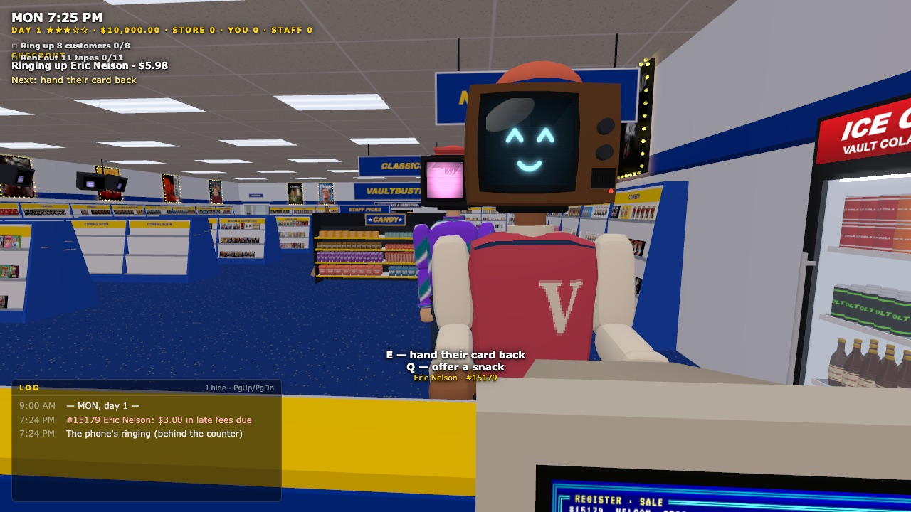
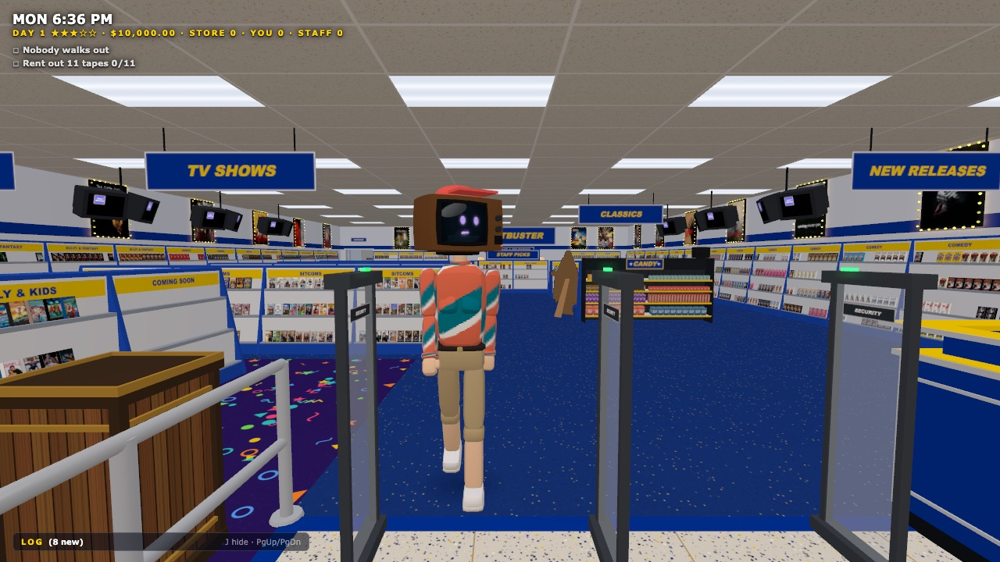
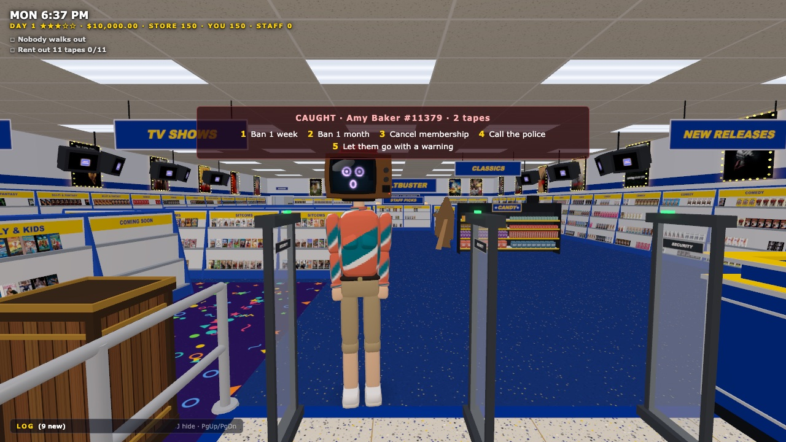
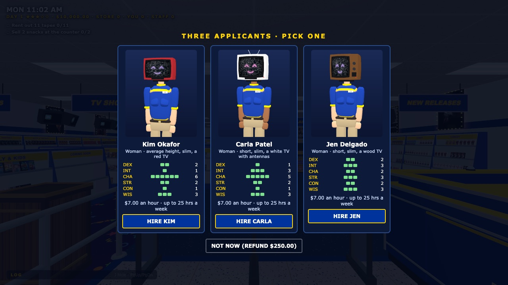
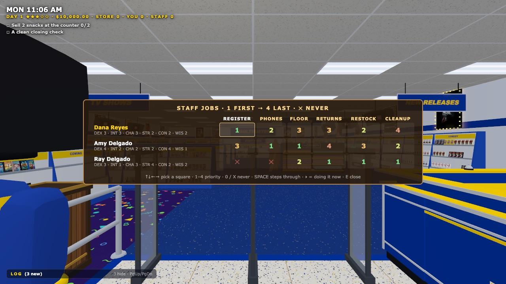
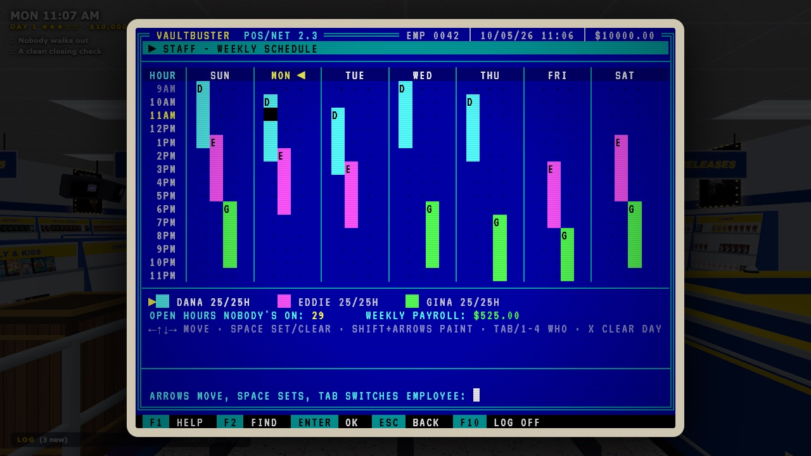
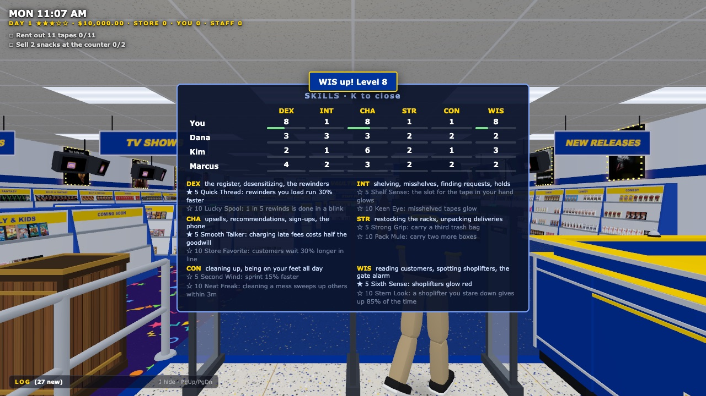
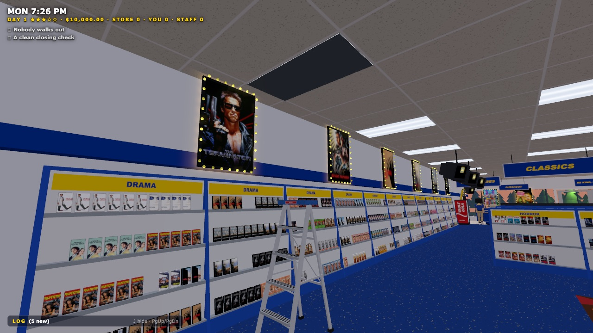
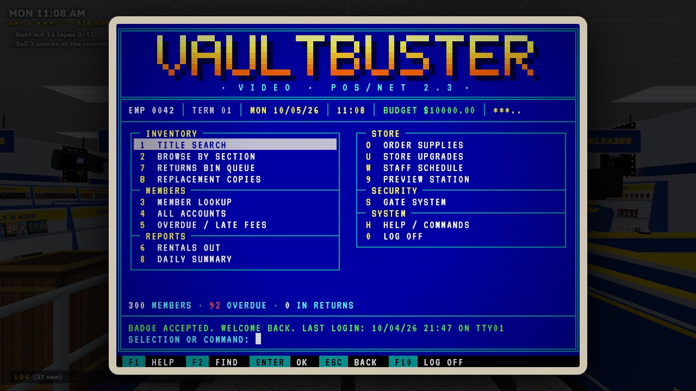
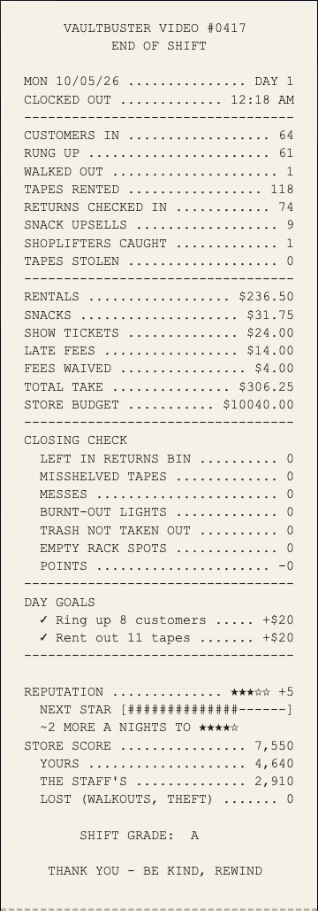

# VaultBuster

**It's 7:25 on a Friday night, there's a line at the counter, somebody by the door has a tape under their jacket, and the store is yours.**

**▶ [Clock in: play it free in your browser](https://chairpants.github.io/VaultBuster/)**



VaultBuster is a first-person shift at a neighborhood video store in the 90s. You're the one behind the counter. You work the register, keep the place running, and turn a half-empty storefront into the store everybody in town goes to on a Friday night.

---

## Your first few minutes

It's 9 AM and the doors are still locked. You have an hour.

**Walk** the floor and **flip on** the lights zone by zone. **Empty** the returns slot, **rewind** what came back, and **shelve** it where it goes. **Stock** the candy rack from the cupboard behind the counter. Then **unlock** the front doors.

The chime goes and the first customer wanders in. They browse, they pick something out, they **come up to the counter**. You **swipe** their card, **ring it up**, **desensitize** the tape so it doesn't set off the gates, **charge** (or waive) their three dollars in late fees, **pitch** them a box of candy, **tear off** the receipt and **hand it over**. Speed matters, and so does getting every step right.

Then the phone rings. Someone wants to know if you have a particular movie in. Say you'll hold it, and it had better be on the holds shelf when they show up.

Then a customer with darting eyes heads for the door.

| | |
|---|---|
|  |  |
| *Darting eyes and a hand on the jacket: they're heading for the gates.* | *Catch them first, then decide: ban, cancel, call the police, or a warning. It all goes on their record.* |

---

## Then it becomes your store

You can't do it all yourself for long, and you're not supposed to.

**Hire.** Post a job opening from the register and three applicants come in to interview, each good at something different. Pick the one you want on your team.

**Schedule.** Lay out their week hour by hour on the register's DOS-style schedule screen. They come in the front door when their shift starts and leave when it ends.

**Delegate.** The job board behind the counter works like a priority grid: register, phones, floor, returns, restock, cleanup. Put your best talker on the register, keep someone strong on restocking, and set the rest to sweep up.

| | |
|---|---|
|  |  |
|  |  |

**Level up.** Everyone has six stats, each one tied to part of the job: **DEX** for register work and rewinding, **INT** for shelving and finding the exact tape someone asked for, **CHA** for upsells and the phone, **STR** for hauling deliveries, **CON** for cleaning and miles walked, **WIS** for spotting shoplifters. The work earns XP, and milestones unlock perks like *Quick Thread*, *Smooth Talker* and *Sixth Sense*. Your clumsy new hire turns into your best clerk.

**Grow.** Every shift ends with a printed slip and a grade. A good night raises your star rating and gets people talking, so more members sign up. Each day comes with goals to hit. Spend what the store earns on upgrades: security cameras, anti-theft signs, a second rewinder, high-speed rewinders shaped like little sports cars, a better cooler, staff training, an ad in the paper, and a theater with an 8 PM feature.

**Keep it clean.** Soda gets spilled, popcorn ends up in the carpet, bins overflow, ceiling lights burn out. Grab the mop, the carpet sweeper, or the step ladder from the janitor's closet. Whatever's left at midnight counts against you on the closing check.

| | | |
|---|---|---|
|  |  |  |

---

## The feel of the place

Buzzing fluorescent tubes, blue carpet, a confetti-print kids' corner, posters ringed with marquee bulbs, and a DOS terminal on the counter that wants an F-key for everything. A customer's TV-set head smiles when you get their order right and scowls when you leave them waiting.

All the sound is generated live instead of recorded: ballast hum, room tone, traffic outside the glass, the door chime, the cooler's compressor kicking on. The day goes by outside the front windows, from morning light to golden hour to sodium lamps over an empty lot. After close it's just you, the lounge lamps and whatever you left undone.

| | |
|---|---|
|  |  |

---

## Clock in

**▶ [Play VaultBuster in your browser](https://chairpants.github.io/VaultBuster/)** — no install, no account. It runs in your browser with keyboard and mouse, and you can play it on a touchscreen too.

- **Simulation** starts you in a bare-bones store: no staff, the theater chained shut, a small member list. Build it up from what it earns.
- **Sandbox** gives you $10,000 and Dana on staff from the start. Buy what you like and get playing.
- **Customer** puts you on the other side of the counter. The store runs itself, and you walk in off the lot with your own wallet. Pay for what you take (or don't, if nobody's looking), stay out of the back, and see how far you can get. Some doors are locked and some things padlocked, and what opens them is out there somewhere. Be a good customer and they'll treat you like a regular. In Simulation, keep the store in the red three nights running and the owner fires you: you're back the next day as a customer.

Three save files, like an old cartridge: pick one to **play**, **copy** or **delete** it. The store remembers where you left everything. If you like it, **star the repo** and tell someone who used to work behind a counter.

---

## Controls

| Key | Action |
|---|---|
| **W A S D** | Walk |
| **Mouse** | Look |
| **Shift** | Hustle |
| **C** | Crouch |
| **Click** a tape | Pick it up and hold it up to look at it |
| **Click** again | Tuck it in your hand |
| **Right-click** | Put back a tape you're still looking at (straight off the shelf or out of Returns) · put down an untouched snack |
| **Click** a snack, drink or popcorn in hand | Take a bite or a sip |
| **E** | Interact: doors, lamps, the register, the counter gear, and plenty more. Some things want E held down. On the stool behind the counter, each tap spins you (tap fast to spin harder) and WASD gets you up; hold E on it to carry it somewhere else. Hold E on a rewinder, the desensitizer or the receipt printer to move it around the counter: a see-through copy shows where it'll go (only over free worktop), the wheel turns it, click sets it down, right-click puts it back |
| **Q** | At the counter: offer the customer a snack (they'll go grab it and come back), or waive their late fees |
| **L** | Skip ahead an hour (until close). The store lights are real switches on the walls: E flips one, and holding E on the panel by the register turns the whole panel on or off |
| **Mouse wheel** | Zoom while seated · otherwise switch the item in hand when carrying several |
| **1–9** | Pick an inventory slot (carry up to 9 items; the bar appears once you hold 2+) |
| **K** | Character sheet: your skills and the staff's, with XP toward the next level |
| **H** | Hide the HUD |
| **M** | Store sounds on/off (fluorescent hum, air, traffic outside, the door chime, footsteps, doors, the cooler) |
| **J** | Show or hide the log (bottom left) · **PgUp / PgDn** scroll it |
| **1–5** | When you've caught a shoplifter: ban a week / a month, cancel their membership, call the police, or let them off with a warning |
| **F** | Fullscreen |

---

## How it's put together

To run it locally, open `index.html` in a browser. It works straight from `file://` with no server; you just need an internet connection, because three.js loads from a CDN.


Everything runs as plain `<script>` files loaded in order. There are no ES modules, so the page works from `file://`. The one exception is a small inline module in `index.html` that imports three.js and its post-processing add-ons from the CDN, puts them on `window`, and then loads `store.js`.

| File | What it is |
|---|---|
| `index.html` | The page, the HUD, and the three.js bootstrap |
| `store.js` | The whole game: the building, shelving and packing, the lounge, lighting, the exterior, and the TVs |
| `couch.js` | The procedurally built parlor sofa |
| `pos.js` | The register's DOS-style POS terminal |
| `ambience.js` | The store's ambient sound, modelled from the physics of each source rather than recorded: ballast hum, room tone, Doppler-shifted traffic through the glass, the entry chime, footsteps, latches and hinges, swing doors, the cooler's door and compressor |
| `monstervision.js` | Splits the single MonsterVision broadcast tape into one tape per film, with each airing mapped to its real title and year |
| `mv-covers.js` | Generated TMDB posters for the MonsterVision films (kept out of `covers.js`, which is near GitHub's 50 MB warning) |
| `catalog.js` | Generated tape catalog (`window.VAULT_CATALOG`) |
| `covers.js` | Generated TMDB cover art, embedded as data URIs (`window.VAULT_ART`) |
| `meta.js` | Generated release year and TMDB vote count per title (`window.VAULT_META`), used to sort the New Releases walls |
| `tests/smoke.mjs` | The smoke tests (see Testing) |
| `tests/shot.mjs` | A screenshot (or frame timing) from anywhere in a fresh store |

### Testing

`tests/smoke.mjs` loads the game headless from `file://` and drives each system through its test hooks: the menu and save files, a full checkout, restocking, a phone hold, moving counter gear, save/reload, the restroom, and a fresh Simulation store: hiring and schedules, skill milestones, the rewinder upgrades, staff clocking out, members' visiting rhythm, day goals, the janitor's closet and the register's sale screen; then a Customer store: in off the lot, paying, getting caught, and a key that keeps through a reload. It needs Node and a Chromium:

```sh
npm install                      # playwright-core (dev only; the game itself has no build)
npx playwright install chromium  # or set PLAYWRIGHT_CHROMIUM_PATH to any Chrome/Chromium
npm test                         # a few minutes: it renders in software
```

To look at something, `tests/shot.mjs` puts you at a spot and takes a screenshot. Add `--setup "<js>"` to arrange things first through the `window.__t` hooks, or `--gpu --fps` to time frames on the real GPU:

```sh
node tests/shot.mjs closet.png 10.3,29.1,-1.7,0.1 --setup "__t.setZone('closet', true)"
node tests/shot.mjs - 3,12,3.14,0 --mode simulation --gpu --fps
```

### Rebuilding the data

The catalog and covers are generated from a local VaultVision library, which the scripts expect at `../VaultVision` unless you pass a different path.

```sh
node build.mjs [path-to-VaultVision]                         # -> catalog.js
TMDB_API_KEY=... node fetch-covers.mjs [path-to-VaultVision] # -> covers.js, meta.js
TMDB_API_KEY=... node fetch-mv-covers.mjs                    # -> mv-covers.js
```

`fetch-covers.mjs` has an `OVERRIDES` table for fixing wrong TMDB matches. The raw source images in `art/` are gitignored. The game doesn't need them at runtime.
